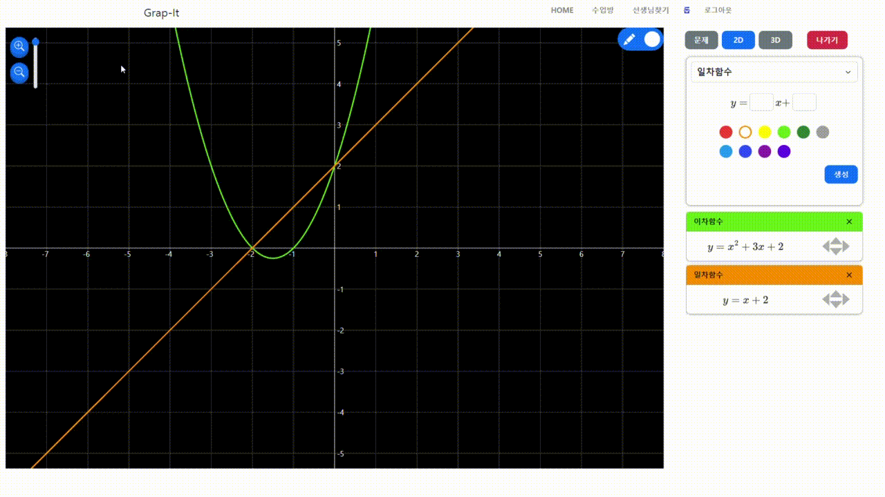
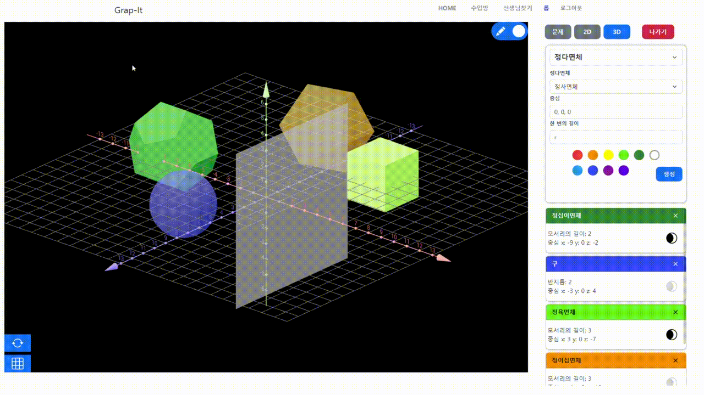
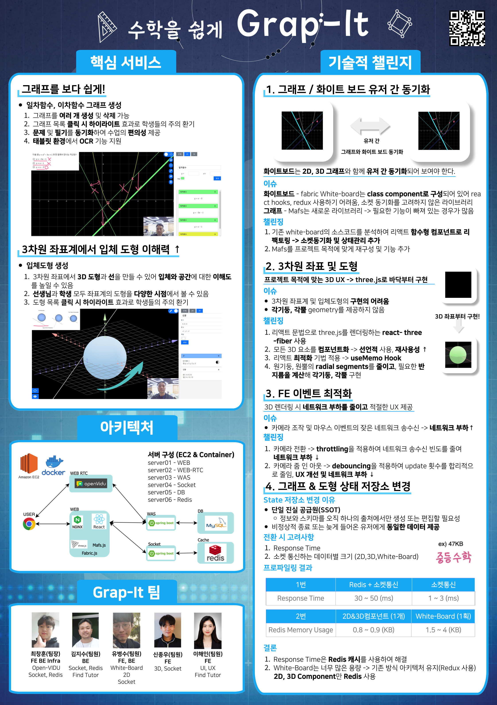

# GrapIt

>  그래프 및 도형 시각화를 제공하는 화상과외 서비스

## 🚀 프로젝트 소개

선생님과 학생이 그래프,도형,화이트보드를 같이 상호작용할 수 있는 서비스






## 🚀 시연영상


## 🚀 사용기술

### BackEnd

SpringBoot, WebSocket, JPA, MySQL, Redis, OpenVIDU

### FrontEnd

React, Redux, Three.js, React-Three-Fiber, Fabric, Mafs, WebSocket 

### Infra

AWS, Docker

## 🚀 주요기능

- 선생님 찾기
- 화상과외(OpenVIDU)
- 2D 그래프
  - 일차 함수, 이차 함수, 원 그래프 생성
  - 그래프 이동(일차 함수)
  - 그래프 하이라이팅
- 3D 도형
  - 선분, 평면, 구, 정다면체, 원뿔, 각기둥 etc..
  - 도형 하이라이팅 및 투명효과
  - 카메라 줌인아웃
  - 카메라 시점 동기화
- 화이트보드
  - 선생님과 학생이 같이 쓰는 칠판
  - 지우개
  - 사진 업로드


## 🚀 포스터




## 🍀 GIT 요약

☘️[상세 설명](https://github.com/hoon25/GrapIt/wiki/GIT-%EC%83%81%EC%84%B8-%EC%A0%84%EB%9E%B5)

### ☘️Branch명 전략

**GitLab-Flow**

- Feature
  - `feature/#issue_number/user_name`
- Development
  - `develop`
- Master
  - `master`

### ☘️commit 규칙

`[#issue_number] ** : commit_head`

```
feat : 새로운 기능에 대한 커밋
fix : 버그 수정에 대한 커밋
build : 빌드 관련 파일 수정에 대한 커밋
chore : 그 외 자잘한 수정에 대한 커밋
ci : CI관련 설정 수정에 대한 커밋
docs : 문서 수정에 대한 커밋
style : 코드 스타일 혹은 포맷 등에 관한 커밋
refactor :  코드 리팩토링에 대한 커밋
test : 테스트 코드 수정에 대한 커밋
```

### ☘️PR 규칙

- 신규개발 - feature/#issue_number 생성 후 PR
- 라벨링
  - `In Progress` - 개발 진행중
  - `Asking for Review` - 코드리뷰 필요
  - `refactoring` - 리뷰 후 리팩토링 필요

- 리뷰어 중 1명 이상의 `Approve` 를 받아야 `Merge pull request` 가능
- `commit` 을 할 때마다 Jenkins CI가 자동으로 실행되며 단위테스트, 통합테스트에 모두 통과되어야 `Merge pull request`가능

